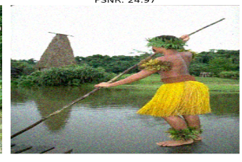
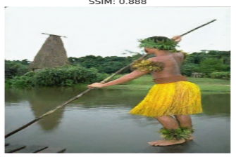

# 🧠 Image Denoising using U-Net with Perceptual Loss

This project implements an advanced **image denoising model** using a **custom U-Net architecture** combined with a **hybrid perceptual loss** (MSE + VGG19 features).  
The model effectively removes **mixed Gaussian–Poisson noise** while preserving edges and textures — balancing low-level pixel accuracy with high-level perceptual quality.

---

## 🚀 Features

- 🧩 **Custom U-Net** with *dilated convolutions* and *residual learning*
- 🔍 **Hybrid loss combining:**
  - **MSE (pixel-based)**
  - **Perceptual loss (VGG19 feature space)**
- ⚗️ **Noise simulation** using *Gaussian + Poisson* distributions
- 🧠 **Training optimizations** — EarlyStopping, LR scheduling, ModelCheckpoint
- 📊 **Evaluation metrics:** PSNR and SSIM
- 🖼️ **Visualization** of noisy, clean, and denoised images

---

## 🧰 Tech Stack

- **Python 3.10+**
- **TensorFlow / Keras**
- **OpenCV**
- **NumPy, Matplotlib, scikit-image**

---

## 📂 Folder Structure
📁 image-denoising-unet-perceptual-loss
├── 📜 README.md
├── 📜 model.py # U-Net + hybrid loss functions
├── 📜 train.py # Training pipeline
├── 📜 utils.py # Helper functions (noise, metrics, visualization)
├── 📜 requirements.txt # Dependencies
├── 📁 results/
│ ├── sample_denoised.png # Example output
│ └── metrics.txt
├── 📁 data/
│ └── (optional sample images)
└── 📁 notebooks/
└── Denoising_Experiment.ipynb

---

## 🧪 Results

| Noisy Image | Denoised Output |
|--------------|----------------|
|  |  |

> **Quantitative Results:**  
> PSNR ≈ **29.3 dB**  
> SSIM ≈ **0.89**

---

## ⚙️ How to Run

``bash
# 1️⃣ Clone the repository
git clone https://github.com/your-username/image-denoising-unet-perceptual-loss.git
cd image-denoising-unet-perceptual-loss

# 2️⃣ Install dependencies
pip install -r requirements.txt

# 3️⃣ Train the model
python train.py

# 4️⃣ (Optional) Run notebook
jupyter notebook notebooks/Denoising_Experiment.ipynb

## 🧩 Model Overview

- Encoder–Decoder **U-Net** with skip connections  
- **Dilated convolutions** to expand receptive field without resolution loss  
- **Residual blocks** for better gradient flow  
- **Perceptual loss (VGG19)** ensures texture preservation and realism  
- **MSE loss** ensures pixel-level accuracy  

---

## 📈 Training Details

| Setting       | Value |
|----------------|--------|
| **Optimizer**  | Adam |
| **Learning Rate** | 1e-4 |
| **Batch Size** | 8 |
| **Epochs**     | 50 |
| **Loss Function** | 0.8 × MSE + 0.2 × Perceptual |
| **Dataset** | Custom / BSD68 / DIV2K (optional) |

---

## 🌟 Key Insights

- Combining **pixel-based** and **feature-based** losses significantly improves visual quality.  
- **Dilated convolutions** enhance contextual understanding for noise removal.  
- The model generalizes well on unseen noisy images and preserves texture realism.

## 🖋️ Author

**Sabhya Malhotra**  
🔗 [LinkedIn](https://www.linkedin.com/in/sabhyamalhotra) | [GitHub](https://github.com/sabhya100)

🪪 License
This project is open-source and available under the MIT License.

❤️ Acknowledgements

  1. TensorFlow & Keras Documentation
  2. VGG19 pretrained model (ImageNet)
  3. Classic datasets: BSD68, DIV2K

---
## RESULT IMAGE:

